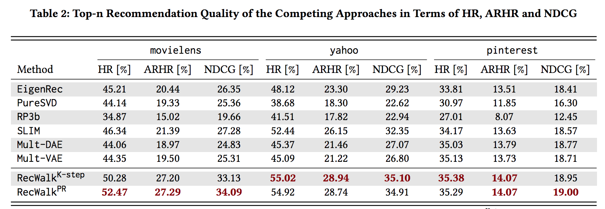
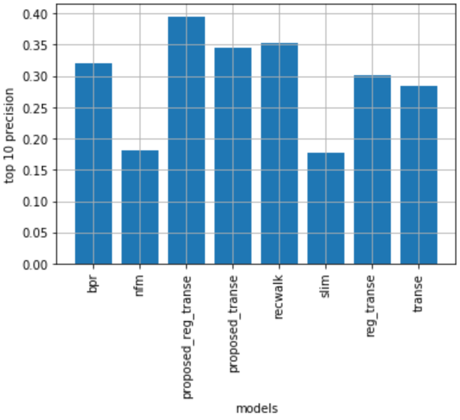

# ページランクと埋め込みの組み合わせ
TransEなどの知識グラフ埋め込み手法とページランクを組み合わせた推薦手法を考えている。説明性に関してあまり考えられていない。一応いくつかの説明性アルゴリズムが適用可能であることはわかっている。

## 1. 背景
[RecWalk](https://www.nikolako.net/papers/ACM_WSDM2019_RecWalk.pdf)と呼ばれる手法を拡張。推薦アルゴリズムの現状の課題に直接取り組んでいるわけではないので、この辺りの背景を詰めたいところ。
### 1-1. RecWalkに関して
WSDM2019の研究。ページランクの拡張。下の表のように単純なアルゴリズムながらDNNベースのモデルより高性能。

ユーザ数$U$、アイテム数$I$でユーザ-アイテムの評価値行列のみが与えられている状況を考える。ユーザとアイテムをノードとした有向グラフを考える。ただしユーザ->アイテムへのリンクとアイテム->ユーザへのリンク両方が張られているとする。次の確率遷移行列にしたがって各ユーザノードに対するPersonalized Page Rank(PPR)を実行。
 $$
P = \alpha H + (1 - \alpha)M
 $$
ここで$H \in \mathbb{R} ^ {{U+I}\times{U+I}}$は有向グラフの隣接行列を正規化したもの、つまりグラフの確率遷移行列。 $M\in \mathbb{R} ^ {{U+I}\times{U+I}}$は $M_{ij}=0(i\leq U, j\leq I)$で、$M_{ij}(i > U, j > U)$がアイテムどうしの（正規化された）類似度になっている行列である。アイテムどうしの類似度は任意の手法で推定する。RecWalk論文では[SLIM](https://pdfs.semanticscholar.org/3b0c/39b323a8cc1a90b3fdee83dad2fd417bd0ce.pdf)という手法を用いていた。RecWalkはグラフの確率遷移行列をノードどうしの類似度で補正してPPRを動かしていると解釈できる。上のMを計算するためのアイテムどうしの類似度を推定するモデルであるSLIMは次のような最適化をする。
$$
\argmin_W \frac{1}{2}\mid\mid A - AW \mid\mid^2_F +
    \frac{\beta}{2}\mid\mid W \mid\mid^2_F + \lambda\mid\mid W \mid\mid_1
$$
$$
subject\quad to \quad W \geq 0\\\\
           \qquad  diag(W) = 0
$$
$A \in \mathbb{R}^{U \times I}$は評価値行列、$W\in\mathbb{R}^{I \times I}$はアイテムどうしの類似度と解釈できる重みである。

PPRは次のようなもの。
$$
\pi_u = \lim_{K\rightarrow\infty}
                    \textbf{e}_u^\top(\mu P + (1-\mu) \textbf{1}\textbf{e}_u^\top)^K

$$
$\textbf{e}_u$はターゲットユーザのインデックスに1それ以外は0の行列。$\pi_u$はターゲットユーザに対するノードの重要度がランキングされているベクトル。推薦の予測ではこのベクトルにもとづいて推薦アイテムをランキングする。

## 2. 手法
RecWalkではユーザ、アイテムのみが与えられたグラフでアイテムのみの類似度を使っていた。ユーザ、アイテム以外の補助情報を考慮したHetero geneouseなグラフで知識グラフの埋め込みを使ってノードどうしの類似度を考慮してみる。

与えられたユーザ、アイテム、ユーザ・アイテムのそれぞれの属性情報をノード数$N$のグラフで表現し、その正規化された隣接行列を$H \in\mathbb{R}^{N\times N}$とする。知識グラフ埋め込みによる各ノードの埋め込み行列どうしの内積を格納して正規化した行列を$M \in\mathbb{R}^{N \times N}$とする。次の確率遷移行列でPPRを動かす。

 $$
P = \alpha H + (1 - \alpha)M
 $$

### 2-1. 知識グラフの埋め込み
今回は[TransE](https://papers.nips.cc/paper/5071-translating-embeddings-for-modeling-multi-relational-data.pdf)を使用。知識グラフ埋め:込み手法は何を使ってもOK。

TransEは次の目的関数を最小化する。
$$
L = \sum_{(h, r, t)\in S} \sum_{(h_{neg}, r, t_{neg})\in S_{neg}}
            \gamma + d(\textbf{h} + \textbf{r}, \textbf{t}) 
             - d(\textbf{h}_{neg} + \textbf{r}, \textbf{t}_{neg})
$$
$S_{neg}$はnegative sample. $d(., .)$はユークリッド距離.

またTransEにノードどうしの内積が小さくなるようなL2正則化項を加えたモデルも実験してみた。正則化項を加えるのは、上のRecWalkの場合のSLIMはアイテムの類似度行列$W$がスパースになっているので、埋め込みベクトルの内積が小さいorスパースになる方がいいのではないかと考えたため。(本当はL1正則化も実験したいが力不足で保留中)

## 実験
### 使ったデータ
小さめ&ある程度密なデータで実験してみた。Amazon Dataset Luxury 5coreを使用。
グラフを構成する際のTriplet(head, relation, entityの三つ組)の種類は
- user ->(buy) item (34278)
- item ->(belong to) brand (1629)
- item ->(also_view) item 
- item ->(also_buy) item 

今回実験したデータは、
- ユーザ数: 3819
- アイテム数: 1581
- ユーザ・アイテムのペア: 34278
- ブランド数: 8
 
アイテムの属性として考えられるのが「ブランド」しかなく、その数も少ないのが問題か。

### 使った手法  
- Bayesian Personalized Ranking(BPR)
- Neural Factorizatin Machine (NFM)
- TransE
- regTransE(正則化つきTransE)
- SLIM
- RecWalk
- Proposed(TransE)
- Proposed(regTransE)

### 結果
Top 10 Precisionで評価。下のグラフのように提案手法のスコアが一番高い。（厳密に交差検証でパラメータチューニング$\rightarrow$テストをしていないのでちょっと怪しい)

## 本当はやりたいこと
page rank awareな埋め込み。次の目的関数の和を最小化。(ここではTransEを例に)

**埋め込み誤差** 
$$
L_{embed} = \sum_{(h, r, t)\in S} \sum_{(h_{neg}, r, t_{neg})\in S_{neg}}
            \gamma + d(\textbf{h} + \textbf{r}, \textbf{t}) 
             - d(\textbf{h}_{neg} + \textbf{r}, \textbf{t}_{neg})
$$

**ページランク誤差**
$$
L_{ppr} = \sum_{u \in User} 
           \mid\mid \pi_u - 
            \{\mu P\pi_u + (1 - \mu)\textbf{e}_u \} \mid\mid^2_F\\\\

P = \alpha H + (1 - \alpha)M
$$
$\pi_u$はあらかじめ計算しておいた各ユーザに対するPersonalized page rank。$\pi_u$は
$$
\textbf{x} = \mu P\textbf{x} + (1 - \mu)\textbf{e}_u 
$$
の解である。埋め込みベクトルによって構成した確率遷移行列が
$$
\pi_u = \mu P\pi_u + (1 - \mu)\textbf{e}_u 
$$
を満たすように最適化することによって、ユーザに対するアイテムのランキングそのものを再現できるような埋め込みを学習したいという気持ち。

予測は埋め込みベクトルで構成した$P$でのPPRで行う。

**追記** \
$\pi_u$はあらかじめ計算しておいた各ユーザに対するPersonalized page rankなので、
$$
\pi_u = \mu H \pi_u + (1 - \mu)\textbf{e}_u
$$
これより
$$
\pi_u - \{\mu P\pi_u + (1 - \mu)\textbf{e}_u \}
    = \pi_u - \mu(1 - \alpha)H\pi_u + \mu(1 - \alpha)M\pi_u
$$
よって
$$
\pi_u - \{\mu P\pi_u + (1 - \mu)\textbf{e}_u \} \\\\
        = \mu(1 - \alpha)H\pi_u + \mu(1 - \alpha)M\pi_u
$$
で$\mu(1 - \alpha)H\pi_u$は定数項なので$\mu(1 - \alpha)M\pi_u$のL_2ノルムをページランク誤差L_pprとして考慮すれば良い

## 現状とToDoリスト
- 大きい & スパースなデータで実験
- 他の比較手法で実験
- 他の埋め込み手法で実験
- 埋め込み手法のL1正則化
- page rank awareな埋め込み手法を実装、実験

### 説明性に関して
このプロジェクトでは説明性に関しては取り組んでいない。上で実験した手法に関しては[PRINCE](https://arxiv.org/abs/1911.08378)と呼ばれる手法や、[影響関数を行列分解に応用したもの](http://www.cs.sjtu.edu.cn/~shen-yy/FIA_KDD19.pdf)を適用することができると考えられる。

## Reference
